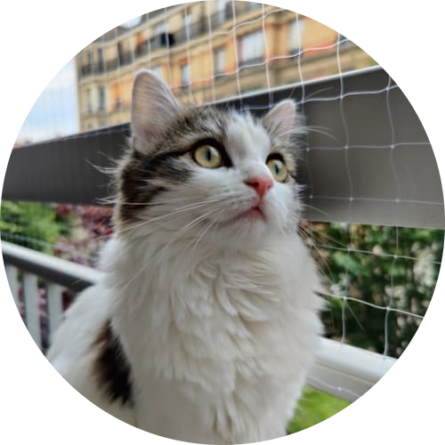
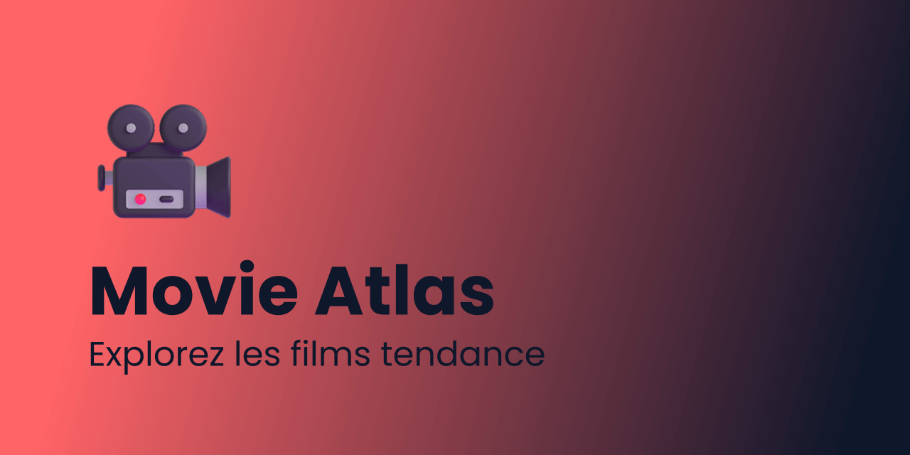
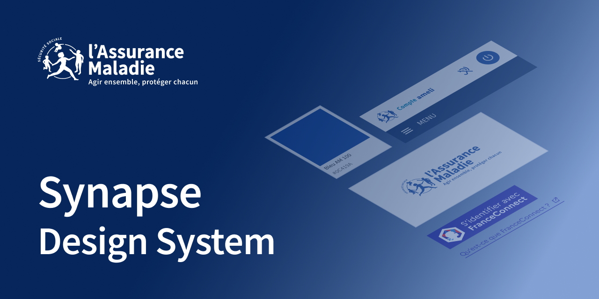
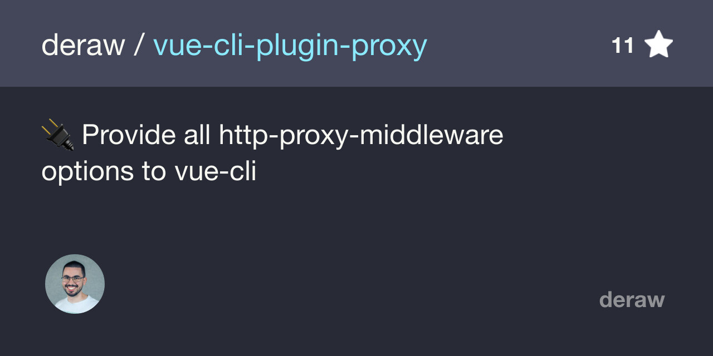

  

  Hi there, I'm Dylan Broussard, a <b>Senior Frontend Engineer</b>.

I was previously working at <a href="https://backmarket.com">Back Market</a> in the <a href="https://revolve.backmarket.com/">Design System</a> team.

  Before that, I created a <a href="https://digital-design-system.netlify.app/">Design System Initiative</a>
  at the <a href="https://www.assurance-maladie.ameli.fr/qui-sommes-nous/organisation/cnam-tete-reseau">French Health Insurance</a>.

## Previous projects

### Movie Atlas

Un projet personnel de découverte de films moderne propulsé par Nuxt 4 et l'API TMDB.

### Synapse

Design System Initiative for the French Health Insurance (Caisse Nationale de l'Assurance Maladie).

### Vue CLI proxy plugin

This was a Vue CLI plugin meant to provide all the options of <a href="https://www.npmjs.com/package/http-proxy-middleware">http-proxy-middleware</a>.
 
 
I may seem a bit weird to put this little project here, but it was my first real experience of managing an open-source project and managing contributions! :octocat:

*PS: This is Arwenn* ❤️
